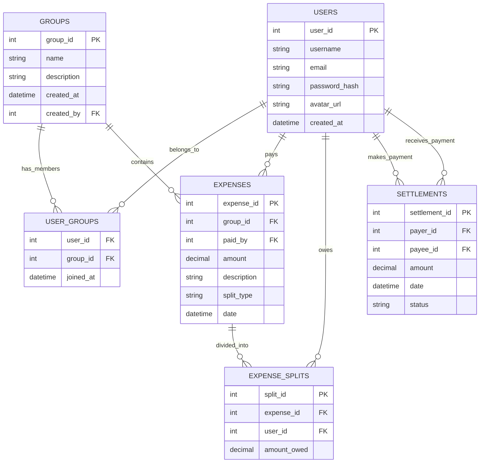

# Expense Splitter App - ER Diagram

```mermaid
erDiagram
    USERS {
        int user_id PK
        string username
        string email
        string password_hash
        string avatar_url
        datetime created_at
    }

    GROUPS {
        int group_id PK
        string name
        string description
        datetime created_at
        int created_by FK
    }

    USER_GROUPS {
        int user_id FK
        int group_id FK
        datetime joined_at
    }

    EXPENSES {
        int expense_id PK
        int group_id FK
        int paid_by FK
        decimal amount
        string description
        string split_type
        datetime date
    }

    EXPENSE_SPLITS {
        int split_id PK
        int expense_id FK
        int user_id FK
        decimal amount_owed
    }

    SETTLEMENTS {
        int settlement_id PK
        int payer_id FK
        int payee_id FK
        decimal amount
        datetime date
        string status
    }

    USERS ||--o{ USER_GROUPS : belongs_to
    GROUPS ||--o{ USER_GROUPS : has_members
    USERS ||--o{ EXPENSES : pays
    GROUPS ||--o{ EXPENSES : contains
    EXPENSES ||--o{ EXPENSE_SPLITS : divided_into
    USERS ||--o{ EXPENSE_SPLITS : owes
    USERS ||--o{ SETTLEMENTS : makes_payment
    USERS ||--o{ SETTLEMENTS : receives_payment
```
