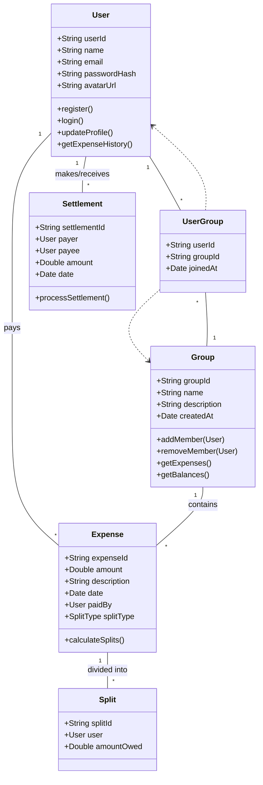

# Expense Splitter App - Class Diagram

```mermaid
classDiagram
    class User {
        +String userId
        +String name
        +String email
        +String passwordHash
        +String avatarUrl
        +register()
        +login()
        +updateProfile()
        +getExpenseHistory()
    }

    class Group {
        +String groupId
        +String name
        +String description
        +Date createdAt
        +addMember(User)
        +removeMember(User)
        +getExpenses()
        +getBalances()
    }

    class Expense {
        +String expenseId
        +Double amount
        +String description
        +Date date
        +User paidBy
        +SplitType splitType
        +calculateSplits()
    }

    class UserGroup {
        +String userId
        +String groupId
        +Date joinedAt
    }
    
    class Split {
        +String splitId
        +User user
        +Double amountOwed
    }

    class Settlement {
        +String settlementId
        +User payer
        +User payee
        +Double amount
        +Date date
        +processSettlement()
    }

    User "1" -- "*" UserGroup
    Group "1" -- "*" UserGroup
    User "1" -- "*" Expense : pays
    Group "1" -- "*" Expense : contains
    Expense "1" -- "*" Split : divided into
    User "1" -- "*" Settlement : makes/receives
    
    %% Relationships
    UserGroup ..> User
    UserGroup ..> Group
```
