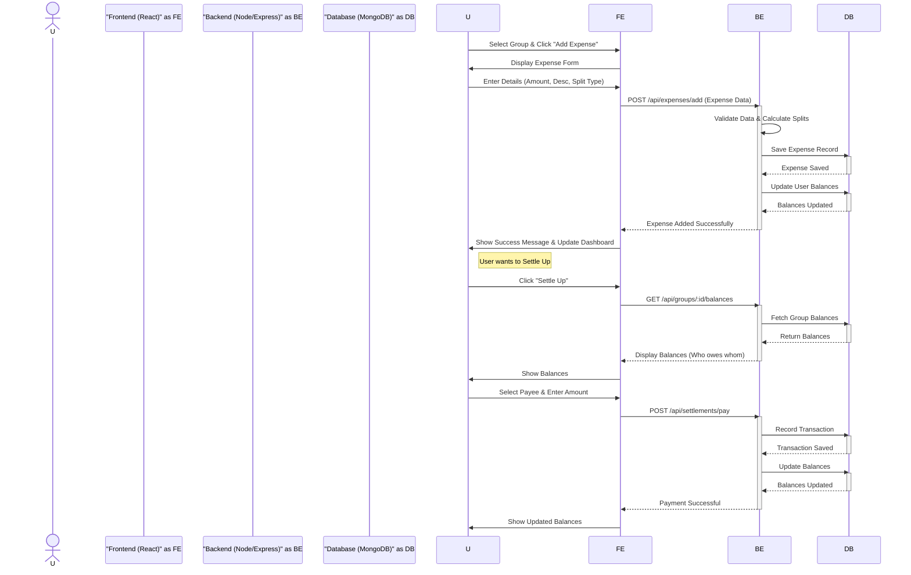

# Expense Splitter App - Sequence Diagram

## Main Flow: Add Expense & Settle Up

```mermaid
sequenceDiagram
    actor User as U
    participant "Frontend (React)" as FE
    participant "Backend (Node/Express)" as BE
    participant "Database (MongoDB)" as DB

    U ->> FE: Select Group & Click "Add Expense"
    FE ->> U: Display Expense Form
    
    U ->> FE: Enter Details (Amount, Desc, Split Type)
    FE ->> BE: POST /api/expenses/add (Expense Data)
    
    activate BE
    BE ->> BE: Validate Data & Calculate Splits
    BE ->> DB: Save Expense Record
    activate DB
    DB -->> BE: Expense Saved
    deactivate DB
    
    BE ->> DB: Update User Balances
    activate DB
    DB -->> BE: Balances Updated
    deactivate DB
    
    BE -->> FE: Expense Added Successfully
    deactivate BE
    
    FE ->> U: Show Success Message & Update Dashboard

    note right of U: User wants to Settle Up

    U ->> FE: Click "Settle Up"
    FE ->> BE: GET /api/groups/:id/balances
    activate BE
    BE ->> DB: Fetch Group Balances
    activate DB
    DB -->> BE: Return Balances
    deactivate DB
    BE -->> FE: Display Balances (Who owes whom)
    deactivate BE
    
    FE ->> U: Show Balances
    U ->> FE: Select Payee & Enter Amount
    FE ->> BE: POST /api/settlements/pay
    activate BE
    BE ->> DB: Record Transaction
    activate DB
    DB -->> BE: Transaction Saved
    deactivate DB
    BE ->> DB: Update Balances
    activate DB
    DB -->> BE: Balances Updated
    deactivate DB
    BE -->> FE: Payment Successful
    deactivate BE
    FE ->> U: Show Updated Balances
```
