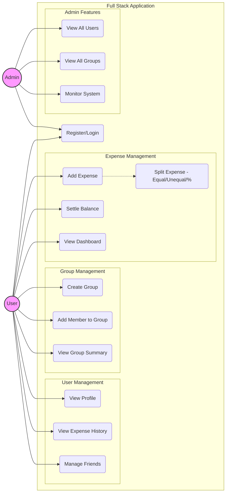

# Expense Splitter App - Use Case Diagram

```mermaid
graph LR
    %% Actors
    U((User))
    A((Admin))

    %% System Boundary
    subgraph System["Full Stack Application"]
        direction TB
        
        UC1(Register/Login)
        
        subgraph UserMgmt["User Management"]
            UC2(View Profile)
            UC3(View Expense History)
            UC4(Manage Friends)
        end

        subgraph GroupMgmt["Group Management"]
            UC5(Create Group)
            UC6(Add Member to Group)
            UC7(View Group Summary)
        end

        subgraph ExpenseMgmt["Expense Management"]
            UC8(Add Expense)
            UC9(Split Expense - Equal/Unequal/%)
            UC10(Settle Balance)
            UC11(View Dashboard)
        end
        
        subgraph AdminFeatures["Admin Features"]
            UC12(View All Users)
            UC13(View All Groups)
            UC14(Monitor System)
        end
    end

    %% Styles
    style U fill:#f9f,stroke:#333,stroke-width:2px
    style A fill:#f9f,stroke:#333,stroke-width:2px

    %% Relationships
    U --> UC1
    U --> UC2
    U --> UC3
    U --> UC4
    U --> UC5
    U --> UC6
    U --> UC7
    U --> UC8
    U --> UC10
    U --> UC11

    %% Include relationship (dashed)
    UC8 -.-> UC9

    A --> UC1
    A --> UC12
    A --> UC13
    A --> UC14
```
